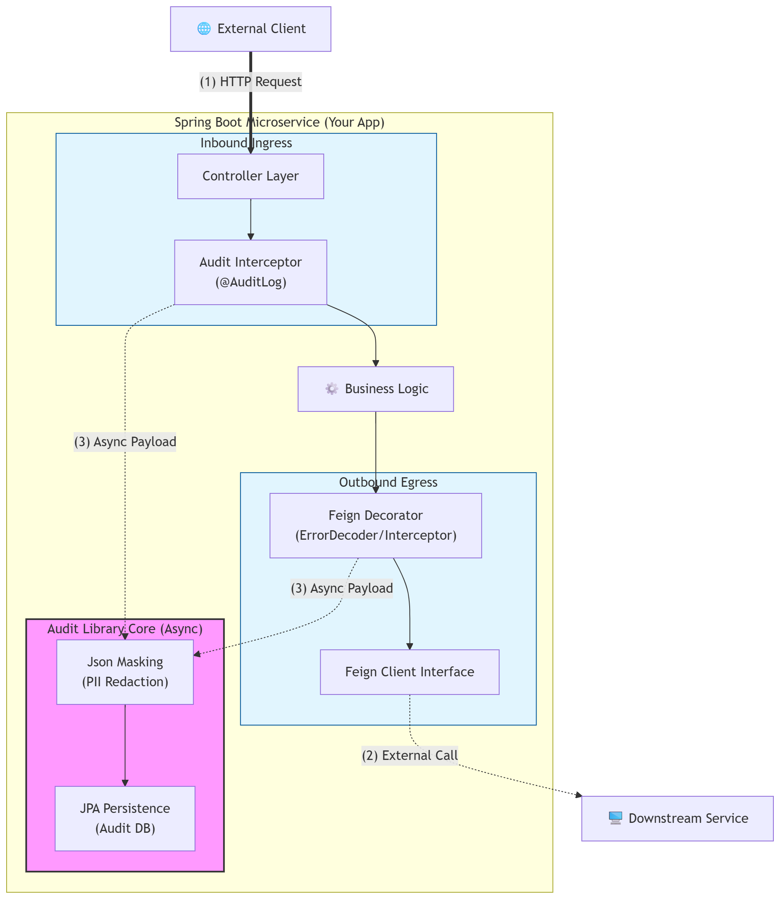

# API Audit & Logging Library


A high-performance, non-invasive auditing library for Spring Boot 3.4+ microservices. This library provides seamless observability for distributed systems by capturing inbound HTTP requests and outbound Feign communication with **zero manual boilerplate**.

---


---
## 🛠️ Installation & Dependency Management

This library is distributed as a JAR. For enterprise environments utilizing a `flatDir` repository structure:

### 1. Configure Repository
In your target project's `build.gradle`, include your local or shared `libs` directory:

```gradle
repositories {
    mavenCentral()
    flatDir {
        dirs "path/to/shared/libs" // Update to your local libs directory path
    }
}
```

### 2. Add Dependency
Add the library to your dependencies block. Note that as a shared library, it requires Java 21 compatibility.
```gradle
dependencies {
    // Audit Library Implementation
    implementation 'com.api.audit:api-audit-log:1.0-SNAPSHOT'
    
    // Core dependencies required by the library (transitive)
    implementation 'org.springframework.boot:spring-boot-starter-data-jpa'
    implementation 'org.springframework.cloud:spring-cloud-starter-openfeign'
}
```

### ⚙️ Configuration Reference
The library is designed with a *fail-safe* and *Off-by-Default* philosophy. All properties are prefixed with 
<i>audit.logging</i>.

| Property | Default | Description                                                                     |
| ----- | ----- |---------------------------------------------------------------------------------|
| audit.logging.enabled	| true | Globally enable/disable the library.                                            |
| audit.logging.feign-error.enabled	|false	| Off by Default. Enables Feign ErrorDecoder for capturing outbound error bodies. |
| audit.logging.cleanup.enabled	|false| 	Enables the automated daily purge of old logs.                                 |
| audit.logging.cleanup.days|	30| 	Number of days to retain logs if cleanup is enabled.                           |
| spring.application.name|	unknown-service	| Essential for tagging logs with the originating service name.                   |

#### Example application.yml
```yaml
audit:
  logging:
    enabled: true
  feign-error:
    enabled: true      # Activates outbound error capture & masking
  cleanup:
    enabled: true      # Enables daily 2AM purge
    days: 15           # Keep logs for 15 days
```

### 📖 Usage Patterns
1. Declarative Auditing
   Apply the '@AuditLog' annotation to Controllers or Feign Clients. The library uses an interceptor to detect this annotation at the class or method level.
```java
@RestController
@AuditLog("User Management")
public class UserController {

    @PostMapping("/sync")
    @AuditLog("Sync my Data")
    public ResponseEntity<Void> sync() { ... }
}
```
2. Safe Feign Chaining
   When _audit.logging.feign-error.enabled_ is true, the library uses a Decorator Pattern to wrap your existing 
   ErrorDecoder. This ensures your custom business exceptions are still thrown after the audit data is captured.

### 🛡️ Safety & Architecture
- Java 21 Optimized: Leverages modern JVM capabilities for high-throughput logging.
- Application Resiliency: Logging persistence is asynchronous. It uses a dedicated logExecutor with a DiscardOldestPolicy to ensure that even under extreme load, the audit library never creates backpressure on your main application threads.
- Automated Redaction: An internal JsonMasker automatically redacts sensitive fields (e.g., password, token, secret, authorization) from all JSON payloads before persistence.
- Stable Lifecycle Management: Utilizes static BeanPostProcessors for JPA configuration, preventing premature bean instantiation and ensuring Spring container stability.
### 🔍 Observability Support
The library exposes an internal management endpoint for log retrieval, designed for integration with support dashboards:
```
GET /internal/audit-logs?correlationId=xyz&type=INCOMING
```

**Available Filters**: correlationId, type (INCOMING/OUTGOING), serviceName, and timestamp ranges.

### 🧪 Testing Integration
To disable auditing during integration tests and prevent unnecessary database interactions:
````java
@SpringBootTest
@TestPropertySource(properties = {
    "audit.logging.enabled=false",
    "audit.logging.feign-error.enabled=false"
})
class ApplicationIntegrationTest { ... }
````