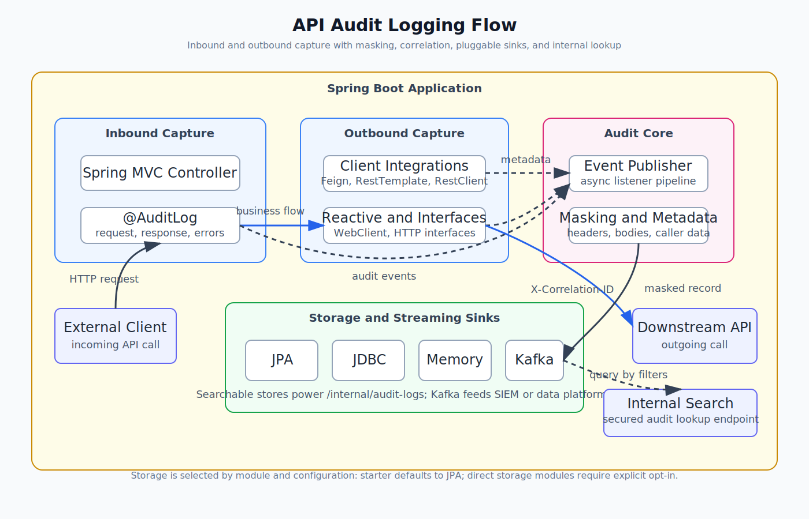

# API Audit Logging


A Spring Boot 3.5+ audit logging starter for capturing inbound and outbound API traffic with very
little application code. The library keeps the capture flow non-invasive: annotate the API surface
you care about, let the starter publish audit events, mask sensitive payload fields, and send the
records to the storage sink you choose.



## What It Captures

- Inbound Spring MVC requests and responses marked with `@AuditLog`
- Outbound Feign calls, including optional error response capture
- Outbound RestTemplate calls through a Spring Boot `RestTemplateCustomizer`
- Outbound RestClient calls through a Spring Boot `RestClientCustomizer`
- Spring HTTP interface clients when they use an audited `RestClient.Builder`
- Outbound WebClient metadata through a Spring Boot `WebClientCustomizer`
- Correlation ID propagation through `X-Correlation-ID`
- Query strings, redacted request headers, and redacted response headers
- Inbound client IP, user agent, and authenticated principal name when available
- Error type and error message for captured failures where available
- Request and response payloads where they can be captured safely
- Masked payloads before any storage backend receives the record

## Modules

Use the starter when you want the opinionated default setup:

```gradle
dependencies {
    implementation "com.api.audit:api-audit-logging-starter:2.2.0"
}
```

The starter currently brings in common auto-configuration, JPA storage, and the Feign,
RestTemplate, and WebClient client integrations. It also applies the starter-owned default
`audit.logging.storage.type=jpa` when the host application has not selected a storage type.

For finer control, depend on only the modules you need:

| Module | Purpose |
|---|---|
| `api-audit-logging-core` | Annotation, event model, SPI, masking, servlet filter, listener, internal endpoint |
| `api-audit-logging-autoconfigure` | Common Spring Boot auto-configuration |
| `api-audit-logging-client-feign` | Feign logger, correlation interceptor, optional error decoder |
| `api-audit-logging-client-resttemplate` | RestTemplate and RestClient interceptors with correlation propagation |
| `api-audit-logging-client-webclient` | WebClient metadata capture and correlation propagation |
| `api-audit-logging-storage-jpa` | JPA entity, repository, store, search store, Flyway path |
| `api-audit-logging-storage-jdbc` | JdbcTemplate store and search store without JPA |
| `api-audit-logging-storage-memory` | In-memory store for demos and tests |
| `api-audit-logging-storage-kafka` | Kafka publishing sink for audit streams |

When storage modules are used directly, select the storage explicitly with
`audit.logging.storage.type`. Direct storage modules do not silently become active just because they
are on the classpath.

## Basic Usage

Annotate a controller class or method:

```java
@RestController
@AuditLog("User Management")
class UserController {

    @PostMapping("/users/sync")
    @AuditLog("Sync User")
    ResponseEntity<Void> syncUser(@RequestBody SyncRequest request) {
        return ResponseEntity.accepted().build();
    }
}
```

Method-level annotations win over class-level annotations. Inbound records are captured after the
response is available, published as an event, masked, and persisted asynchronously.

## Storage Choices

### JPA

JPA is the default storage in `api-audit-logging-starter`.

```gradle
implementation "com.api.audit:api-audit-logging-autoconfigure:2.2.0"
implementation "com.api.audit:api-audit-logging-storage-jpa:2.2.0"
```

Enable the library migration path if you want Flyway to create the audit table:

```yaml
audit:
  logging:
    storage:
      type: jpa
    flyway:
      enabled: true
```

When Flyway integration is enabled, the library chooses a vendor-specific migration folder from the
active JDBC URL:

| Database | Migration location |
|---|---|
| H2 | `classpath:db/audit-migrations/h2` |
| PostgreSQL | `classpath:db/audit-migrations/postgresql` |
| MySQL / MariaDB | `classpath:db/audit-migrations/mysql` |
| SQL Server | `classpath:db/audit-migrations/sqlserver` |
| Oracle | `classpath:db/audit-migrations/oracle` |

If your organization owns schema migration centrally, keep `audit.logging.flyway.enabled=false` and
copy the matching DDL into your own migration chain.

### JDBC

Use JDBC when you want database-backed audit logs without JPA:

```gradle
implementation "com.api.audit:api-audit-logging-autoconfigure:2.2.0"
implementation "com.api.audit:api-audit-logging-storage-jdbc:2.2.0"
```

JDBC uses the same table shape as JPA and also supports the internal search endpoint.

If both JPA and JDBC modules are present, select JDBC explicitly:

```yaml
audit:
  logging:
    storage:
      type: jdbc
```

### Memory

Use memory storage for demos, local experiments, and tests:

```gradle
implementation "com.api.audit:api-audit-logging-autoconfigure:2.2.0"
implementation "com.api.audit:api-audit-logging-storage-memory:2.2.0"
```

Records are lost when the application stops.

If another storage module is also present, select memory explicitly:

```yaml
audit:
  logging:
    storage:
      type: memory
```

### Kafka

Use Kafka when audit records should flow into a stream processor, SIEM, or central data platform:

```gradle
implementation "com.api.audit:api-audit-logging-autoconfigure:2.2.0"
implementation "com.api.audit:api-audit-logging-storage-kafka:2.2.0"
```

Kafka is opt-in:

```yaml
audit:
  logging:
    storage:
      type: kafka
    kafka:
      enabled: true
      topic: api-audit-logs
```

Kafka is a write sink only. If you need `/internal/audit-logs`, pair Kafka with a searchable store
or provide your own `AuditLogSearchStore`.

For downstream consumers, SIEM indexing, alert examples, and topic design, see the
[Kafka and SIEM Consumer Guide](docs/kafka-siem-consumer-guide.md).

## Client Integrations

### Feign

Add `api-audit-logging-client-feign` to capture annotated Feign calls. The module configures:

- `feign.Logger` for outbound success responses
- `RequestInterceptor` for correlation propagation
- optional `ErrorDecoder` wrapping when `audit.logging.feign-error.enabled=true`

### RestTemplate and RestClient

Add `api-audit-logging-client-resttemplate` to customize Spring-managed `RestTemplate` and
`RestClient.Builder` instances. The interceptor captures request and response bodies and re-buffers
the response for normal application processing.

Spring HTTP interface clients are covered through the same path when the proxy is backed by a
Boot-managed `RestClient.Builder`:

```java
@HttpExchange("/inventory")
interface InventoryClient {

    @GetExchange("/{sku}")
    String findItem(@PathVariable String sku);
}
```

The proxy itself does not need audit-specific code. Build it from the audited `RestClient` and the
library captures the underlying HTTP exchange.

### WebClient

Add `api-audit-logging-client-webclient` to customize Spring-managed `WebClient.Builder`
instances. The first version captures method, URL, status, duration, and correlation ID. It does
not consume reactive request or response bodies because doing so safely requires body re-publishing.

## Demo App Profiles

The sample app includes profiles that show the same API capture flow with different sinks:

```powershell
.\gradlew.bat :api-audit-demo-app:bootRun --args="--spring.profiles.active=jpa"
.\gradlew.bat :api-audit-demo-app:bootRun --args="--spring.profiles.active=jdbc"
.\gradlew.bat :api-audit-demo-app:bootRun --args="--spring.profiles.active=memory"
.\gradlew.bat :api-audit-demo-app:bootRun --args="--spring.profiles.active=kafka"
.\gradlew.bat :api-audit-demo-app:bootRun --args="--spring.profiles.active=path-controls"
```

The `jpa`, `jdbc`, and `memory` profiles expose `/internal/audit-logs` because they have searchable
stores. The `kafka` profile publishes records to Kafka only; use `KAFKA_BOOTSTRAP_SERVERS` to point
it at a broker.

Useful demo endpoints:

| Endpoint | What it demonstrates |
|---|---|
| `/api/v1/hello` | Method-level inbound capture |
| `/api/v2/hello` | Class-level inbound capture |
| `/api/v1/echo` | POST body capture and masking path |
| `/api/v1/multi-hop` | Inbound plus outbound RestTemplate correlation |
| `/api/v1/demo/feign` | Feign outbound capture |
| `/api/v1/demo/webclient` | WebClient outbound metadata capture |
| `/api/v1/demo/restclient` | RestClient outbound capture |
| `/api/v1/demo/http-interface` | HTTP interface client backed by audited RestClient |
| `/api/v1/demo/no-audit/ping` | Path exclusion when `path-controls` profile is active |

Set `DEMO_DOWNSTREAM_BASE_URL` or `DEMO_DOWNSTREAM_STATUS_URL` when you want the outbound examples to
call a real local service instead of the placeholder URL.

For cross-service trace examples using `X-Correlation-ID`, see the
[Multi-Service Correlation Guide](docs/multi-service-correlation-guide.md).

## Configuration Reference

All properties use the `audit.logging` prefix.

| Property | Default | Description |
|---|---:|---|
| `audit.logging.enabled` | `true` | Globally enable or disable audit logging |
| `audit.logging.async.core-pool-size` | `5` | Core threads in the audit executor |
| `audit.logging.async.max-pool-size` | `20` | Maximum threads in the audit executor |
| `audit.logging.async.queue-capacity` | `1000` | Queue size before rejection policy applies |
| `audit.logging.async.rejection-policy` | `CALLER_RUNS` | `CALLER_RUNS`, `DISCARD_OLDEST`, `DISCARD`, or `ABORT` |
| `audit.logging.capture.max-body-size` | `1048576` | Maximum request/response body bytes copied into an audit record |
| `audit.logging.capture.max-header-size` | `20000` | Maximum serialized request/response header bytes copied into an audit record |
| `audit.logging.capture.included-paths` | `["/**"]` | Ant-style inbound paths allowed for capture |
| `audit.logging.capture.excluded-paths` | `[]` | Ant-style inbound paths skipped before request/response wrapping |
| `audit.logging.feign-error.enabled` | `false` | Capture Feign error responses through an error decoder wrapper |
| `audit.logging.flyway.enabled` | `false` | Add the library's vendor-specific migration path to Flyway |
| `audit.logging.cleanup.enabled` | `false` | Enable scheduled cleanup for JPA storage |
| `audit.logging.cleanup.days` | `30` | Retention period for cleanup |
| `audit.logging.cleanup.cron` | `0 0 2 * * *` | Spring cron expression for cleanup |
| `audit.logging.storage.type` | module default | Prefer one built-in storage module: `jpa`, `jdbc`, or `memory`; use `kafka` together with Kafka settings |
| `audit.logging.kafka.enabled` | `false` | Enable Kafka as the audit sink when the Kafka module is present |
| `audit.logging.kafka.topic` | `api-audit-logs` | Kafka topic for audit records |
| `audit.logging.internal.api-key` | none | API key for `/internal/audit-logs`; blank means fail-secure |
| `audit.logging.masking.additional-fields` | `[]` | Extra JSON field names to redact |

### Path Controls

Path controls apply to inbound Spring MVC capture before the servlet request and response are
wrapped. Exclusions win over inclusions.

```yaml
audit:
  logging:
    capture:
      included-paths:
        - /api/**
      excluded-paths:
        - /actuator/**
        - /internal/**
```

This is useful when a service wants the audit library enabled broadly but still wants to avoid
health checks, internal operational endpoints, static assets, or any route whose payload should
never be copied into an audit record.

The demo app includes a `path-controls` profile that captures `/api/**` but skips
`/api/v1/demo/no-audit/**`.

### Metrics

When Micrometer and a `MeterRegistry` are present, the auto-configuration publishes low-cardinality
audit metrics:

| Meter | Type | Tags | Meaning |
|---|---|---|---|
| `api.audit.records.saved` | counter | `type` | Records successfully saved or published |
| `api.audit.records.failed` | counter | `type`, `exception` | Records that failed during masking or storage |
| `api.audit.store.duration` | timer | `type` | Time spent handing a record to the active store |

The library does not tag metrics by URL, correlation ID, headers, or payload fields. That keeps
metrics useful without creating high-cardinality pressure in production monitoring systems.

## Internal Search Endpoint

When the active storage module implements `AuditLogSearchStore`, the starter exposes:

```http
GET /internal/audit-logs?correlationId=abc&type=INCOMING&method=GET&httpStatus=200
X-Audit-Api-Key: your-secret
```

The endpoint is fail-secure. If `audit.logging.internal.api-key` is missing or blank, requests are
blocked.

Supported filters are `correlationId`, `start`, `end`, `type`, `url`, `serviceName`, `method`,
`httpStatus`, `clientIp`, `principalName`, and `errorType`. Date filters use ISO date-time values.
The JPA, JDBC, and memory stores all honor the same filter contract.

Common log types are `INCOMING`, `INCOMING_ERROR`, `OUTGOING`, `OUTGOING_ERROR`, and
`OUTGOING_TRANSPORT_ERROR`. Transport errors represent outbound calls that failed before an HTTP
response was available, such as connection, DNS, timeout, or TLS failures.

The library also ships Spring Boot configuration metadata, so IDEs can suggest the
`audit.logging.*` properties and known values such as `audit.logging.storage.type`.

Because this endpoint can expose audit data, read the
[Internal Endpoint Security Guide](docs/internal-endpoint-security-guide.md) before enabling it in
production. The built-in API key is a fail-secure guard, but production systems should still protect
the endpoint with network controls, Spring Security, gateway rules, TLS, and secret rotation.

## Payload Masking

`JsonMasker` redacts common sensitive fields before records reach storage. Built-in fields include
`password`, `token`, `cvv`, `cardNumber`, `secret`, and `authorization`.

Add domain-specific fields as needed:

```yaml
audit:
  logging:
    masking:
      additional-fields:
        - otp
        - nationalId
        - pin
```

## Testing

Disable audit logging in host integration tests when audit persistence is not part of the scenario:

```java
@SpringBootTest
@TestPropertySource(properties = "audit.logging.enabled=false")
class ApplicationIntegrationTest {
}
```

For tests that need audit behavior without a database, use `api-audit-logging-storage-memory`.
