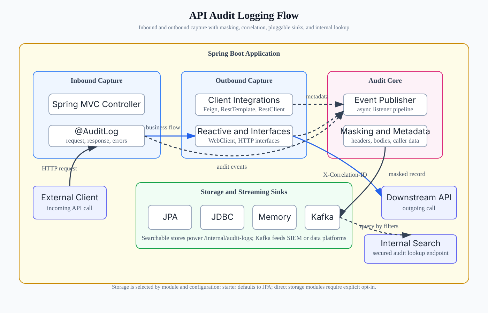

# API Audit Logging


A Spring Boot 3.5+ audit logging starter for capturing inbound and outbound API traffic with very
little application code. The library keeps the capture flow non-invasive: annotate the API surface
you care about, let the starter publish audit events, mask sensitive payload fields, and send the
records to the storage sink you choose.



## What It Captures

- Inbound Spring MVC requests and responses marked with `@AuditLog`
- Outbound Feign calls, including optional error response capture
- Outbound RestTemplate calls through a Spring Boot `RestTemplateCustomizer`
- Outbound RestClient calls through a Spring Boot `RestClientCustomizer`
- Spring HTTP interface clients when they use an audited `RestClient.Builder`
- Outbound WebClient metadata through a Spring Boot `WebClientCustomizer`
- Correlation ID propagation through `X-Correlation-ID`
- Query strings, redacted request headers, and redacted response headers
- Inbound client IP, user agent, and authenticated principal name when available
- Error type and error message for captured failures where available
- Request and response payloads where they can be captured safely
- Masked payloads before any storage backend receives the record

## Modules

Use the starter when you want the opinionated default setup:

```gradle
dependencies {
    implementation "io.github.puneet-swarup:api-audit-logging-starter:2.2.0"
}
```

The starter currently brings in common auto-configuration, JPA storage, and the Feign,
RestTemplate, and WebClient client integrations. It also applies the starter-owned default
`audit.logging.storage.type=jpa` when the host application has not selected a storage type.

For finer control, depend on only the modules you need:

| Module | Purpose |
|---|---|
| `api-audit-logging-core` | Annotation, event model, SPI, masking, servlet filter, listener, internal endpoint |
| `api-audit-logging-autoconfigure` | Common Spring Boot auto-configuration |
| `api-audit-logging-client-feign` | Feign logger, correlation interceptor, optional error decoder |
| `api-audit-logging-client-resttemplate` | RestTemplate and RestClient interceptors with correlation propagation |
| `api-audit-logging-client-webclient` | WebClient metadata capture and correlation propagation |
| `api-audit-logging-storage-jpa` | JPA entity, repository, store, search store, Flyway path |
| `api-audit-logging-storage-jdbc` | JdbcTemplate store and search store without JPA |
| `api-audit-logging-storage-memory` | In-memory store for demos and tests |
| `api-audit-logging-storage-kafka` | Kafka publishing sink for audit streams |
| `api-audit-logging-storage-file` | JSON-lines file / stdout sink for local and container use |
| `api-audit-logging-test` | Test slice and assertions for host applications |

When storage modules are used directly, select the storage explicitly with
`audit.logging.storage.type`. Direct storage modules do not silently become active just because they
are on the classpath.

## Basic Usage

Annotate a controller class or method:

```java
@RestController
@AuditLog("User Management")
class UserController {

    @PostMapping("/users/sync")
    @AuditLog("Sync User")
    ResponseEntity<Void> syncUser(@RequestBody SyncRequest request) {
        return ResponseEntity.accepted().build();
    }
}
```

Method-level annotations win over class-level annotations. Inbound records are captured after the
response is available, published as an event, masked, and persisted asynchronously.

## Path-Based Auditing (No Code Changes)

You can audit API traffic without annotating controllers at all. Declare the paths you care about in configuration, add the library, and restart the JVM - no application code changes are required. This is the recommended mode when you want auditing to be a deployment concern rather than something threaded through the codebase.

Step 1 - enable path-based auditing and declare rules in application.yml. This example audits payment APIs with tags, captures only metadata for orders, restricts a rule to mutation methods, and explicitly excludes the health surface:

    audit:
      logging:
        enabled: true
        policies:
          path-based:
            enabled: true
            rules:
              - pattern: /api/v1/payments/**
                description: Payment APIs
                tags:
                  module: payments
                  tier: critical
              - pattern: /api/v1/orders/**
                capture: METADATA_ONLY
              - pattern: /api/v1/accounts/**
                methods: [POST, PUT, PATCH]
                description: Account mutations
              - pattern: /actuator/**
                audit: false

Step 2 - restart the JVM. That is the entire change.

Key points:

- Annotation-based auditing keeps working and stays enabled by default. The two modes coexist.
- When both an annotation and a path rule match, the annotation supplies the description and tags.
- An explicit audit: false rule always wins over any positive rule.
- Rules are ranked by specificity, so a broad /** rule will not shadow a precise one.
- pattern uses Ant syntax by default; set matcher: REGEX to use a regular expression instead.
- capture can be FULL (default), METADATA_ONLY, or BODY_ONLY.

To run purely from configuration, disable the annotation policy:

    audit:
      logging:
        policies:
          annotation:
            enabled: false
          path-based:
            enabled: true
            rules:
              - pattern: /api/**
                description: All APIs

See the [Path-Based Auditing Guide](docs/path-based-auditing-guide.md) for the full rule reference, precedence details, capture modes, tags, custom policies, and troubleshooting. The demo app ships a path-based profile that proves the zero-code-change flow against an unannotated controller:

    .\gradlew.bat :api-audit-demo-app:bootRun --args="--spring.profiles.active=path-based"

## Sampling and Metrics

Sampling reduces audit volume on high-traffic services. When enabled, a configurable fraction of
successful records is stored and the rest are dropped; error records are always stored so failures
are never lost.

    audit:
      logging:
        sampling:
          enabled: true
          sample-rate: 0.1
          always-capture-errors: true

The library records audit activity through an `AuditMetrics` SPI. When Micrometer is on the
classpath, counters and timers are registered automatically:

| Meter | Type | Meaning |
|---|---|---|
| `api.audit.records.saved` | counter | Records successfully stored, tagged by `type` |
| `api.audit.records.failed` | counter | Masking or storage failures, tagged by `type` and `exception` |
| `api.audit.records.dropped` | counter | Deliberate drops, tagged by `reason` (`QUEUE_FULL`, `SAMPLED`) and `type` |
| `api.audit.store.duration` | timer | Time spent handing a record to the active store, tagged by `type` |

A non-Micrometer no-op implementation is used when Micrometer is absent, and a custom `AuditMetrics`
bean always takes precedence.

## Storage Choices

### JPA

JPA is the default storage in `api-audit-logging-starter`.

```gradle
implementation "io.github.puneet-swarup:api-audit-logging-autoconfigure:2.2.0"
implementation "io.github.puneet-swarup:api-audit-logging-storage-jpa:2.2.0"
```

Enable the library migration path if you want Flyway to create the audit table:

```yaml
audit:
  logging:
    storage:
      type: jpa
    flyway:
      enabled: true
```

When Flyway integration is enabled, the library chooses a vendor-specific migration folder from the
active JDBC URL:

| Database | Migration location |
|---|---|
| H2 | `classpath:db/audit-migrations/h2` |
| PostgreSQL | `classpath:db/audit-migrations/postgresql` |
| MySQL / MariaDB | `classpath:db/audit-migrations/mysql` |
| SQL Server | `classpath:db/audit-migrations/sqlserver` |
| Oracle | `classpath:db/audit-migrations/oracle` |

If your organization owns schema migration centrally, keep `audit.logging.flyway.enabled=false` and
copy the matching DDL into your own migration chain.

> **Flyway 10+ note:** Flyway moved database support into separate modules. If the host uses Flyway
> 10 or newer, add the matching module for your database (for example `flyway-database-postgresql`
> or `flyway-mysql`) alongside `flyway-core`, or Flyway reports an unsupported database. This applies
> to any Flyway-based migration, including this library's.

### JDBC

Use JDBC when you want database-backed audit logs without JPA:

```gradle
implementation "io.github.puneet-swarup:api-audit-logging-autoconfigure:2.2.0"
implementation "io.github.puneet-swarup:api-audit-logging-storage-jdbc:2.2.0"
```

JDBC uses the same table shape as JPA and also supports the internal search endpoint.

If both JPA and JDBC modules are present, select JDBC explicitly:

```yaml
audit:
  logging:
    storage:
      type: jdbc
```

### Memory

Use memory storage for demos, local experiments, and tests:

```gradle
implementation "io.github.puneet-swarup:api-audit-logging-autoconfigure:2.2.0"
implementation "io.github.puneet-swarup:api-audit-logging-storage-memory:2.2.0"
```

Records are lost when the application stops.

If another storage module is also present, select memory explicitly:

```yaml
audit:
  logging:
    storage:
      type: memory
```

### Kafka

Use Kafka when audit records should flow into a stream processor, SIEM, or central data platform:

```gradle
implementation "io.github.puneet-swarup:api-audit-logging-autoconfigure:2.2.0"
implementation "io.github.puneet-swarup:api-audit-logging-storage-kafka:2.2.0"
```

Kafka is opt-in:

```yaml
audit:
  logging:
    storage:
      type: kafka
    kafka:
      enabled: true
      topic: api-audit-logs
```

Kafka is a write sink only. If you need `/internal/audit-logs`, pair Kafka with a searchable store
or provide your own `AuditLogSearchStore`.

### File / stdout

Use the JSON-lines sink for local development, containers, and lightweight SRE setups. Records are
written as one JSON object per line, which is easy to tail and ship.

    implementation "io.github.puneet-swarup:api-audit-logging-storage-file:3.0.0"

    audit:
      logging:
        storage:
          type: file        # or: stdout
        file:
          path: logs/audit.log

This is a write sink only. Pair it with a searchable store if you also need `/internal/audit-logs`.

For downstream consumers, SIEM indexing, alert examples, and topic design, see the
[Kafka and SIEM Consumer Guide](docs/kafka-siem-consumer-guide.md).

For Maven Central release setup, see the
[Maven Central Publishing Guide](docs/maven-central-publishing-guide.md).

For a complete, copy-paste reference covering every packaging style (fat JAR, WAR, plain JAR,
Docker/Kubernetes), storage choice, configuration mechanism, schema handling, and a verification
checklist, see the [Deployment Guide](docs/deployment-guide.md).

## Client Integrations

### Feign

Add `api-audit-logging-client-feign` to capture annotated Feign calls. The module configures:

- `feign.Logger` for outbound success responses
- `RequestInterceptor` for correlation propagation
- optional `ErrorDecoder` wrapping when `audit.logging.feign-error.enabled=true`

### RestTemplate and RestClient

Add `api-audit-logging-client-resttemplate` to customize Spring-managed `RestTemplate` and
`RestClient.Builder` instances. The interceptor captures request and response bodies and re-buffers
the response for normal application processing.

Spring HTTP interface clients are covered through the same path when the proxy is backed by a
Boot-managed `RestClient.Builder`:

```java
@HttpExchange("/inventory")
interface InventoryClient {

    @GetExchange("/{sku}")
    String findItem(@PathVariable String sku);
}
```

The proxy itself does not need audit-specific code. Build it from the audited `RestClient` and the
library captures the underlying HTTP exchange.

### WebClient

Add `api-audit-logging-client-webclient` to customize Spring-managed `WebClient.Builder`
instances. The first version captures method, URL, status, duration, and correlation ID. It does
not consume reactive request or response bodies by default, because doing so safely requires
body re-publishing. Metadata (method, URL, status, duration, headers, correlation ID) is always
captured.

Response-body capture is opt-in and safe: the body is buffered, recorded, and re-published so the
caller still receives it.

    audit:
      logging:
        webclient:
          capture-bodies: true

Request bodies cannot be read from an opaque `ClientRequest` body; to capture a request body, build
the request with `AuditBodyInserters.fromValue(value, holder)`.

## Demo App Profiles

The sample app includes profiles that show the same API capture flow with different sinks:

```powershell
.\gradlew.bat :api-audit-demo-app:bootRun --args="--spring.profiles.active=jpa"
.\gradlew.bat :api-audit-demo-app:bootRun --args="--spring.profiles.active=jdbc"
.\gradlew.bat :api-audit-demo-app:bootRun --args="--spring.profiles.active=memory"
.\gradlew.bat :api-audit-demo-app:bootRun --args="--spring.profiles.active=kafka"
.\gradlew.bat :api-audit-demo-app:bootRun --args="--spring.profiles.active=path-controls"
.\gradlew.bat :api-audit-demo-app:bootRun --args="--spring.profiles.active=path-based"
.\gradlew.bat :api-audit-demo-app:bootRun --args="--spring.profiles.active=sampling"
```

The `jpa`, `jdbc`, `memory`, and `path-based` profiles expose `/internal/audit-logs` because they
have searchable stores. The `kafka` profile publishes records to Kafka only; use
`KAFKA_BOOTSTRAP_SERVERS` to point it at a broker. The `path-based` profile demonstrates
zero-code-change auditing against an unannotated controller; see the
[demo app README](api-audit-demo-app/README.md) for the full endpoint map.

Useful demo endpoints:

| Endpoint | What it demonstrates |
|---|---|
| `/api/v1/hello` | Method-level inbound capture |
| `/api/v2/hello` | Class-level inbound capture |
| `/api/v1/echo` | POST body capture and masking path |
| `/api/v1/multi-hop` | Inbound plus outbound RestTemplate correlation |
| `/api/v1/demo/feign` | Feign outbound capture |
| `/api/v1/demo/webclient` | WebClient outbound metadata capture |
| `/api/v1/demo/restclient` | RestClient outbound capture |
| `/api/v1/demo/http-interface` | HTTP interface client backed by audited RestClient |
| `/api/v1/demo/no-audit/ping` | Path exclusion when `path-controls` profile is active |
| `/api/v1/path-audited/hello` | Path-based capture with no annotation (`path-based` profile) |
| `/api/v1/path-audited/metadata/ping` | `METADATA_ONLY` capture mode (`path-based` profile) |
| `/api/v1/path-audited/body-only/echo` | `BODY_ONLY` capture mode (`path-based` profile) |
| `/api/v1/path-audited/mutations` | Method-scoped rule, POST/PUT only (`path-based` profile) |
| `/api/v1/path-audited/orders/42` | Regex matcher rule (`path-based` profile) |

Set `DEMO_DOWNSTREAM_BASE_URL` or `DEMO_DOWNSTREAM_STATUS_URL` when you want the outbound examples to
call a real local service instead of the placeholder URL.

For cross-service trace examples using `X-Correlation-ID`, see the
[Multi-Service Correlation Guide](docs/multi-service-correlation-guide.md).

## Comprehensive Examples

The [`api-audit-logging-examples`](api-audit-logging-examples/README.md) module is a runnable
cookbook covering every option and feature: annotation and path-based capture, all rule options,
capture modes, masking, custom policies, custom maskers, sampling, every storage sink, and every
outbound client. Start there when integrating the library into a production service.

## Configuration Reference

All properties use the `audit.logging` prefix.

| Property | Default | Description |
|---|---:|---|
| `audit.logging.enabled` | `true` | Globally enable or disable audit logging |
| `audit.logging.async.core-pool-size` | `5` | Core threads in the audit executor |
| `audit.logging.async.max-pool-size` | `20` | Maximum threads in the audit executor |
| `audit.logging.async.queue-capacity` | `1000` | Queue size before rejection policy applies |
| `audit.logging.async.rejection-policy` | `CALLER_RUNS` | `CALLER_RUNS`, `DISCARD_OLDEST`, `DISCARD`, or `ABORT` |
| `audit.logging.capture.max-body-size` | `1048576` | Maximum request/response body bytes copied into an audit record |
| `audit.logging.capture.max-header-size` | `20000` | Maximum serialized request/response header bytes copied into an audit record |
| `audit.logging.capture.included-paths` | `["/**"]` | Ant-style inbound paths allowed for capture |
| `audit.logging.capture.excluded-paths` | `[]` | Ant-style inbound paths skipped before request/response wrapping |
| `audit.logging.feign-error.enabled` | `false` | Capture Feign error responses through an error decoder wrapper |
| `audit.logging.flyway.enabled` | `false` | Add the library's vendor-specific migration path to Flyway |
| `audit.logging.cleanup.enabled` | `false` | Enable scheduled retention purge across all retention-capable stores |
| `audit.logging.cleanup.days` | `30` | Retention period for cleanup |
| `audit.logging.cleanup.cron` | `0 0 2 * * *` | Spring cron expression for cleanup |
| `audit.logging.storage.type` | module default | Prefer one built-in storage module: `jpa`, `jdbc`, or `memory`; use `kafka` together with Kafka settings |
| `audit.logging.kafka.enabled` | `false` | Enable Kafka as the audit sink when the Kafka module is present |
| `audit.logging.kafka.topic` | `api-audit-logs` | Kafka topic for audit records |
| `audit.logging.internal.api-key` | none | API key for `/internal/audit-logs`; blank means fail-secure |
| `audit.logging.masking.additional-fields` | `[]` | Extra JSON field names to redact |
| `audit.logging.policies.annotation.enabled` | `true` | Evaluate the `@AuditLog` annotation policy |
| `audit.logging.policies.path-based.enabled` | `false` | Enable configuration-driven path auditing |
| `audit.logging.policies.path-based.rules[*].pattern` | none | Path pattern to match (required per rule) |
| `audit.logging.policies.path-based.rules[*].matcher` | `ANT` | `ANT` or `REGEX` |
| `audit.logging.policies.path-based.rules[*].audit` | `true` | `false` creates an explicit skip rule |
| `audit.logging.policies.path-based.rules[*].methods` | `[]` | HTTP methods the rule applies to; empty means all |
| `audit.logging.policies.path-based.rules[*].description` | derived | Description stored on matched records |
| `audit.logging.policies.path-based.rules[*].capture` | `FULL` | `FULL`, `METADATA_ONLY`, or `BODY_ONLY` |
| `audit.logging.policies.path-based.rules[*].tags` | `{}` | Custom key/value dimensions attached to records |
| `audit.logging.sampling.enabled` | `false` | Enable sampling of successful records |
| `audit.logging.sampling.sample-rate` | `1.0` | Fraction of non-error records to store (0.0–1.0) |
| `audit.logging.sampling.always-capture-errors` | `true` | Always store error records regardless of sample rate |
| `audit.logging.webclient.capture-bodies` | `false` | Capture (and re-publish) WebClient response bodies |
| `audit.logging.file.path` | `audit.log` | Destination file for the JSON-lines sink (`storage.type=file`) |

### Path Controls

Path controls apply to inbound Spring MVC capture before the servlet request and response are
wrapped. Exclusions win over inclusions.

```yaml
audit:
  logging:
    capture:
      included-paths:
        - /api/**
      excluded-paths:
        - /actuator/**
        - /internal/**
```

This is useful when a service wants the audit library enabled broadly but still wants to avoid
health checks, internal operational endpoints, static assets, or any route whose payload should
never be copied into an audit record.

The demo app includes a `path-controls` profile that captures `/api/**` but skips
`/api/v1/demo/no-audit/**`.

### Metrics

When Micrometer and a `MeterRegistry` are present, the auto-configuration publishes low-cardinality
audit metrics:

| Meter | Type | Tags | Meaning |
|---|---|---|---|
| `api.audit.records.saved` | counter | `type` | Records successfully saved or published |
| `api.audit.records.failed` | counter | `type`, `exception` | Records that failed during masking or storage |
| `api.audit.store.duration` | timer | `type` | Time spent handing a record to the active store |

The library does not tag metrics by URL, correlation ID, headers, or payload fields. That keeps
metrics useful without creating high-cardinality pressure in production monitoring systems.

## Internal Search Endpoint

When the active storage module implements `AuditLogSearchStore`, the starter exposes:

```http
GET /internal/audit-logs?correlationId=abc&type=INCOMING&method=GET&httpStatus=200
GET /internal/audit-logs?tagKey=module&tagValue=payments
X-Audit-Api-Key: your-secret
```

The endpoint is fail-secure. If `audit.logging.internal.api-key` is missing or blank, requests are
blocked.

Supported filters are `correlationId`, `start`, `end`, `type`, `url`, `serviceName`, `method`,
`httpStatus`, `clientIp`, `principalName`, `errorType`, `tagKey`, and `tagValue`. Date filters use
ISO date-time values. Use `tagKey` alone to match any record carrying that tag, or `tagKey` with
`tagValue` to match an exact key/value pair. The JPA, JDBC, and memory stores all honor the same
filter contract.

The underlying `AuditLogSearchStore` SPI is framework-neutral: it accepts an `AuditLogQuery` and
returns an `AuditLogPage`, so a custom store never needs to depend on Spring Data. HTTP pagination
is handled at the web layer. If you maintain a custom store and are upgrading from an earlier
version, see the [SPI Migration Guide](docs/spi-migration-guide.md).

Common log types are `INCOMING`, `INCOMING_ERROR`, `OUTGOING`, `OUTGOING_ERROR`, and
`OUTGOING_TRANSPORT_ERROR`. Transport errors represent outbound calls that failed before an HTTP
response was available, such as connection, DNS, timeout, or TLS failures.

The library also ships Spring Boot configuration metadata, so IDEs can suggest the
`audit.logging.*` properties and known values such as `audit.logging.storage.type`.

Because this endpoint can expose audit data, read the
[Internal Endpoint Security Guide](docs/internal-endpoint-security-guide.md) before enabling it in
production. The built-in API key is a fail-secure guard, but production systems should still protect
the endpoint with network controls, Spring Security, gateway rules, TLS, and secret rotation.

## Payload Masking

Masking runs before any storage backend receives a record, so every sink benefits automatically.
The default implementation, `JsonTreePayloadMasker`, parses the payload and masks sensitive fields
by walking the JSON tree. It correctly handles nested objects and arrays, masks values of any type
(string, number, boolean), and never corrupts payloads that contain commas, braces, or quotes.
Payloads that are not JSON (for example XML or form data) are left unchanged rather than rejected.

Built-in fields include `password`, `token`, `cvv`, `cardNumber`, `secret`, and `authorization`.
Matching is case-insensitive and by containment, so `card` matches both `cardNumber` and `debitCard`.

Add domain-specific fields as needed:

```yaml
audit:
  logging:
    masking:
      additional-fields:
        - otp
        - nationalId
        - pin

To use a custom redaction strategy, register a PayloadMasker bean. It replaces the default JSON-tree masker automatically:

    @Bean
    PayloadMasker payloadMasker() {
      return payload -> myRulesEngine.redact(payload);
    }
```

## Testing

Disable audit logging in host integration tests when audit persistence is not part of the scenario:

```java
@SpringBootTest
@TestPropertySource(properties = "audit.logging.enabled=false")
class ApplicationIntegrationTest {
}
```

For tests that need audit behavior without a database, use `api-audit-logging-storage-memory`.

To assert that your endpoints produce the audit records you expect, add `api-audit-logging-test` and
use `@EnableAuditLoggingTest`:

    @SpringBootTest
    @AutoConfigureMockMvc
    @EnableAuditLoggingTest
    class PaymentAuditTest {

      @Autowired MockMvc mockMvc;
      @Autowired CapturedAuditLogs auditLogs;

      @Test
      void capturesIncoming() throws Exception {
        mockMvc.perform(get("/api/v1/payments/42"));
        auditLogs.single().hasType("INCOMING").hasMethod("GET").hasStatus(200);
      }
    }

`CapturedAuditLogs` records every published audit event (no database needed); `AuditLogAssertions`
offers fluent checks (`hasType`, `hasMethod`, `hasStatus`, `hasTag`, `requestBodyContains`, and more).
